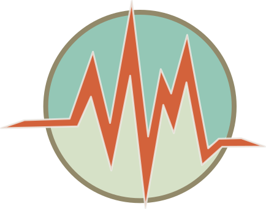

  

 

GOST (Go-SensorThings) is a sensor server written in Go. It implements the [OGC SensorThings API] (http://ogc-iot.github.io/ogc-iot-api/api.html) standard.

## Disclaimer

GOST is alpha software and is not considered appropriate for customer use. Feel free to help development :-)

## License

GOST licensed under [MIT](https://opensource.org/licenses/MIT).

## Getting started

1. Install
 1. Install GoLang https://golang.org/
 2. Install Postgresql http://www.postgresql.org/

2. Clone code
 1. git clone https://github.com/Geodan/gost.git

3. Get dependencies
 1. go get gopkg.in/yaml.v2
 2. go get github.com/lib/pq
 3. go get github.com/gorilla/mux
 4. go get github.com/surge/glog
 5. go get github.com/surgemq/surgemq
 6. go get github.com/surgemq/message

4. Edit config.yaml
 1. Change connection to database

5. Start
 1. go run main.go

6. Go in browser to http://localhost:8080

## Dependencies

[yaml v2](https://github.com/go-yaml/yaml) 
[pq](https://github.com/lib/pq) 
[mux](https://github.com/gorilla/mux) 
[SurgeMQ](github.com/surgemq/surgemq) 

## Roadmap

- Complete implementation of the OGC SensorThings spec
- Tests!
- MQTT
- Frontend
- Benchmarks
- Different storage providers such as MongoDB (Now using PostgreSQL)

## TODO

[See wiki](https://github.com/Geodan/gost/wiki/TODO)
