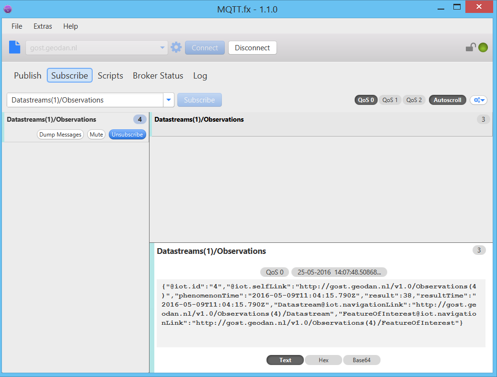
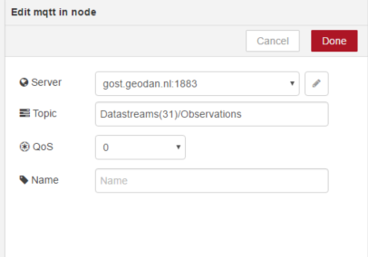
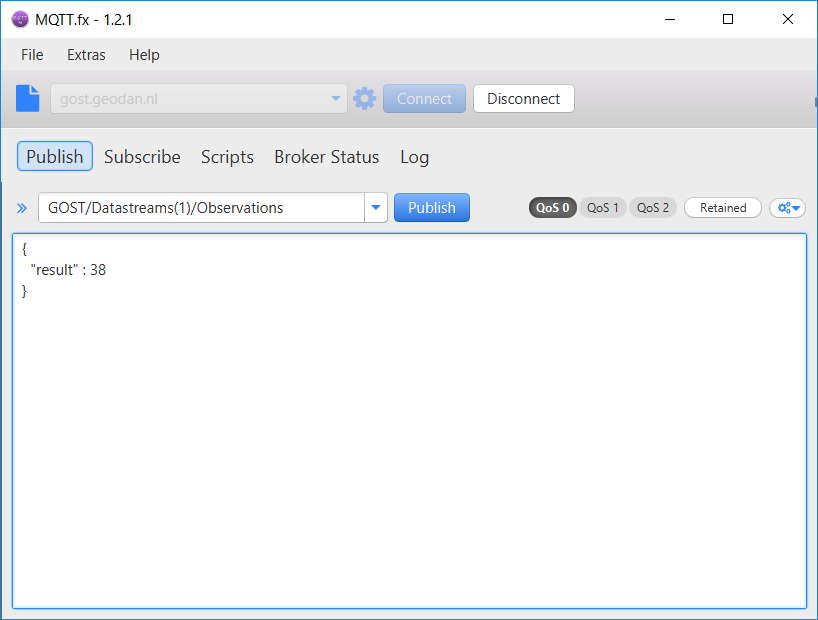
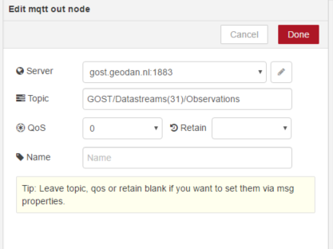

## Gost MQTT - Getting started

SensorThings Api has an MQTT extension allowing users/devices to publish and subscribe to updates. In 
this article two usecases are described: Receiving and Publishing data.

## 1] Receiving MQTT data

How to subscribe to Mqtt messages:

. Console tool: Mosquitto (http://mosquitto.org/)

Mosquitto is an open source message broker that implements the MQTT protocol versions 3.1 and 3.1.1. 

```sh
mosquitto_sub -h gost.geodan.nl -t "Datastreams(1)/Observations"
```

. Desktop tool: MQTT.fx (http://mqttfx.jfx4ee.org/)

Connect to: gost.geodan.nl

Subscribe to: Datastream(1)/Observations



. Node-RED



. Java

todo

. .NET

using NuGet package M2Mqtt (https://www.nuget.org/packages/M2Mqtt/)

Code sample: (https://gist.github.com/bertt/e7f30456a44e4e138ebf784bcddefad9)

. Python

todo

. Javascript

Use Paho library http://www.eclipse.org/paho/

Code sample:

```sh
client = new Paho.MQTT.Client(location.hostname, Number(9001), guid());
client.onConnectionLost = onConnectionLost;
client.onMessageArrived = onMessageArrived;
client.connect({ onSuccess: onConnect });

function onConnect() {
    client.subscribe("Datastreams(1)/Observations");
}

 // called when a message arrives
function onMessageArrived(message) {
}
```

testcase: publish an observation using the following HTTP Request and check if information is received:

```sh
curl -X POST -H "Accept: application/json" -H "Content-Type: application/json" -d '{
  "phenomenonTime": "2016-05-09T11:04:15.790Z",
  "resultTime" : "2016-05-09T11:04:15.790Z",
  "result" : 38,
  "Datastream":{"@iot.id":"1"}
}' "http://gost.geodan.nl/v1.0/Observations"
```

## 2] Publishing MQTT data

Hint: For publishing to MQTT GOST add a prefix 'GOST' to the topic

. Mosquitto

```sh
mosquitto_pub -h gost.geodan.nl -t "GOST/Datastreams(1)/Observations" -m '{"result" : 38}'
```
. MQTT.fx




. Node-RED



. .NET

todo 

. Python

todo

. Javascript

todo


